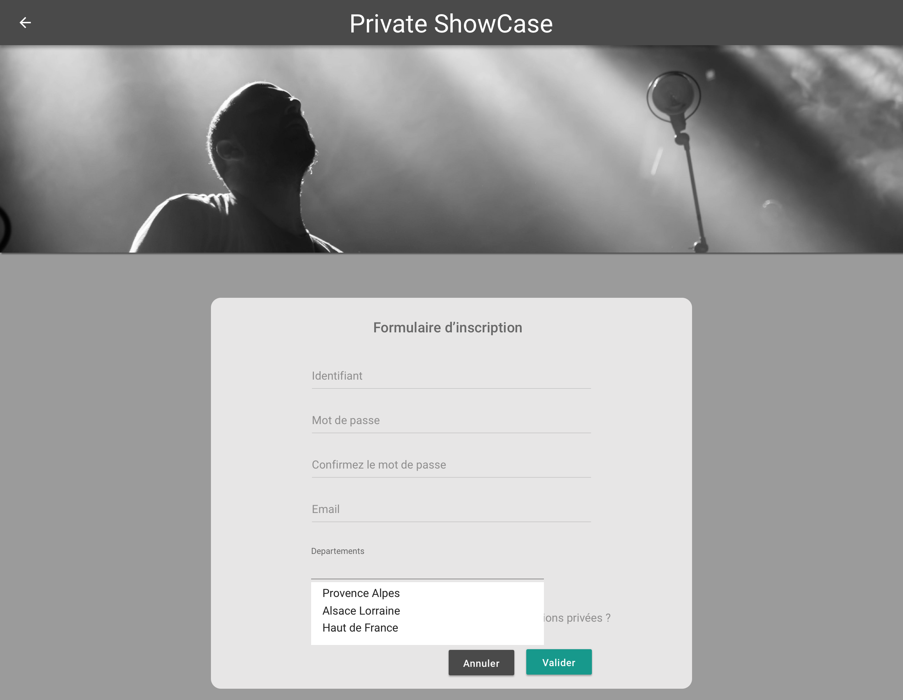

# Page d'insciption pour un utilisateur

## Description

En tant que visiteur, je peux m'inscrire sur l'application Private ShowCase

## Critères d'acceptance

- Validation du formulaire
    - Login : le login doit être unique pour l'application
    - Mot de passe : 8 caractères minimum, comporte au moins une majascule, une minuscule et un chiffre
    - Confirmation : Doit être identique au mot de passe
    - Email : email valide
    - Ville : Champ autocomplete pour choisir une ville
    - CheckBox artiste : ne doit pas être cochée
    - Tous les champs sont requis à l'execption de la checkbox

- Navigation
    - Annuler : Retour vers la page d'accueil
    - Valider : Création de l'utilisteur en base et navigation vers la page de login.