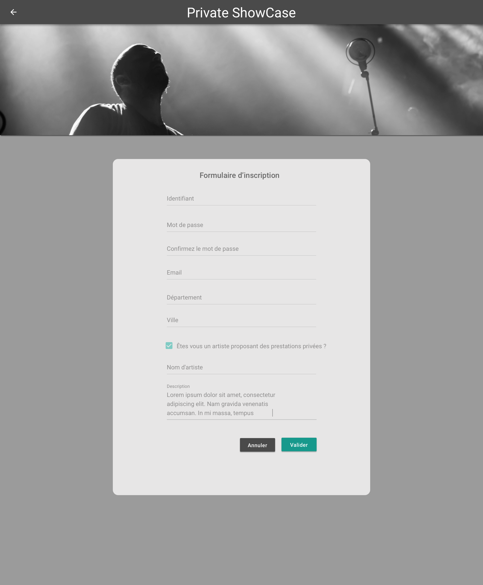

# Page d'insciption pour un artiste

## Description

En tant qu'artiste, je peux m'inscrire sur l'application Private ShowCase

## Critères d'acceptance

- Validation du formulaire
    - Login : le login doit être unique pour l'application
    - Mot de passe : 8 caractères minimum, comporte au moins une majascule, une minuscule et un chiffre
    - Confirmation : Doit être identique au mot de passe
    - Email : email valide
    - Ville : Champ autocomplete pour choisir une ville
    - CheckBox artiste : doit être cochée
    - Nom d'artiste : Doit être unique dans l'application
    - Description : Ce champs est requis et représente la description courte pour un artiste
    - Tous les champs sont requis
    - Le bouton 'Valider' est disable tant que tous les champs du formulaire ne sont pas valide

- Navigation
    - Annuler : Retour vers la page d'accueil
    - Valider : Création de l'utilisteur en base et navigation vers la page de login.