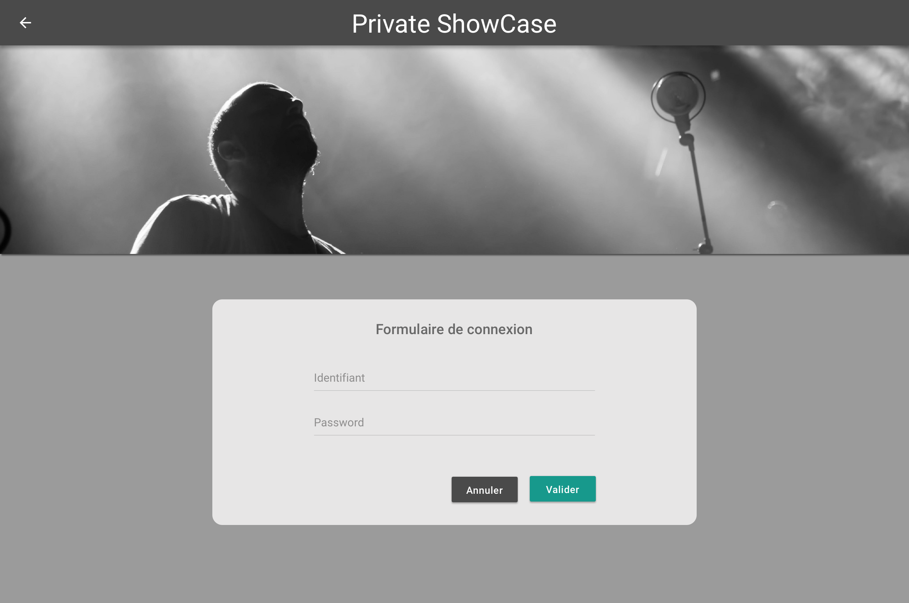

# Page d'authentification

## Description

En tant qu'utilisateur (user et artist), je peux m'authentifier sur l'application Private ShowCase

## Critères d'acceptance

- Validation du formulaire
    - Login : le login doit être unique pour l'application
    - Mot de passe : 8 caractères minimum, comporte au moins une majascule, une minuscule et un chiffre
    - Tous les champs sont requis

- Navigation
    - Annuler : Retour vers la page d'accueil
    - Valider : L'utilisteur existe en base et le couple login / mot de passe correspond à ceux saisis dans le formulaire.
    Le token JWT pour l'authentification est récupéré et stocké pour les futurrs appels réseaux qui nécessiterint une authentification.
    Navigation vers la page Home.