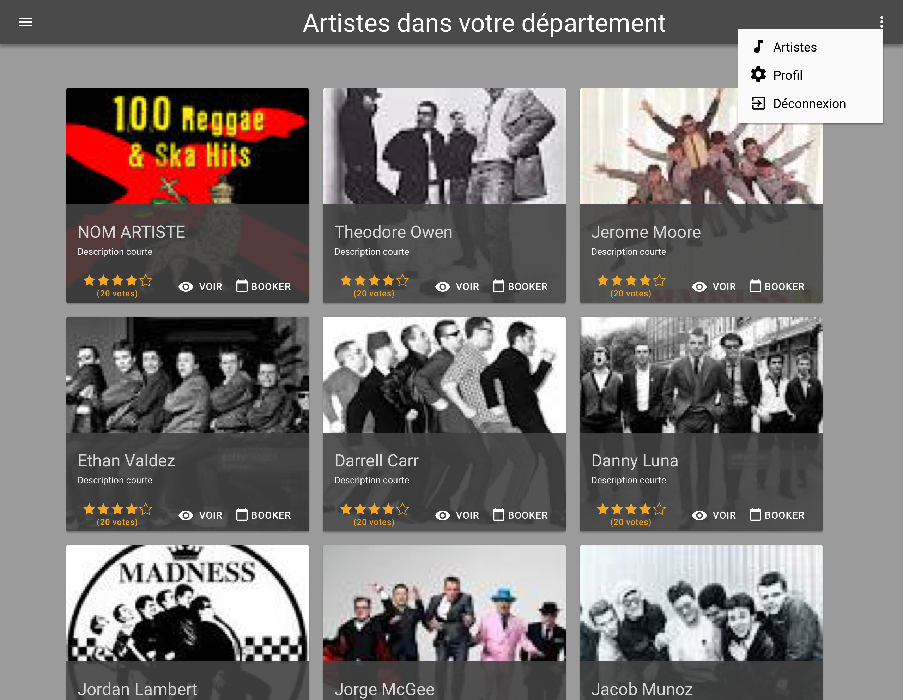

# Page Home User Settings

## Description

En tant qu'utilisateur (user et artist), je souhaite pouvoir paramétrer mon profil.

## Critères d'acceptance

- Depuis le header, un bouton 'options' permet d'afficher la liste des paramétrages possibles
    - Si je suis authentifié comme un artiste, l'option artiste est affichée dans la liste
- Items
    - Artistes => Permet de naviguer vers la page Artiste
    - Profil => Permet de naviguer vers la page Profil
    - Déconnexion => Déconnecte l'utilisateur, néttoie toutes ses données, navigation vers la page d'accueil
- Lorsque le menu est ouvert, un clic dans l'interface ferme le menu