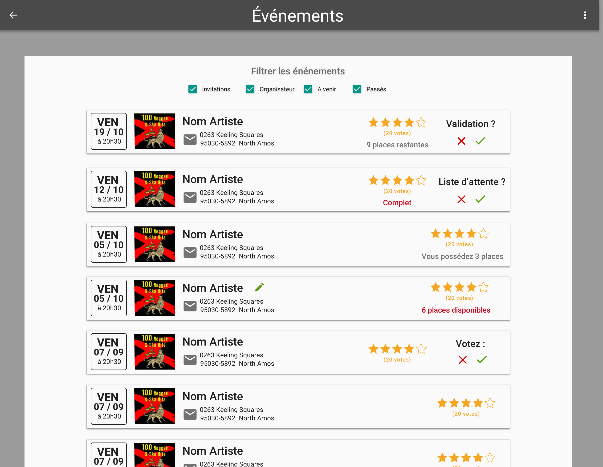
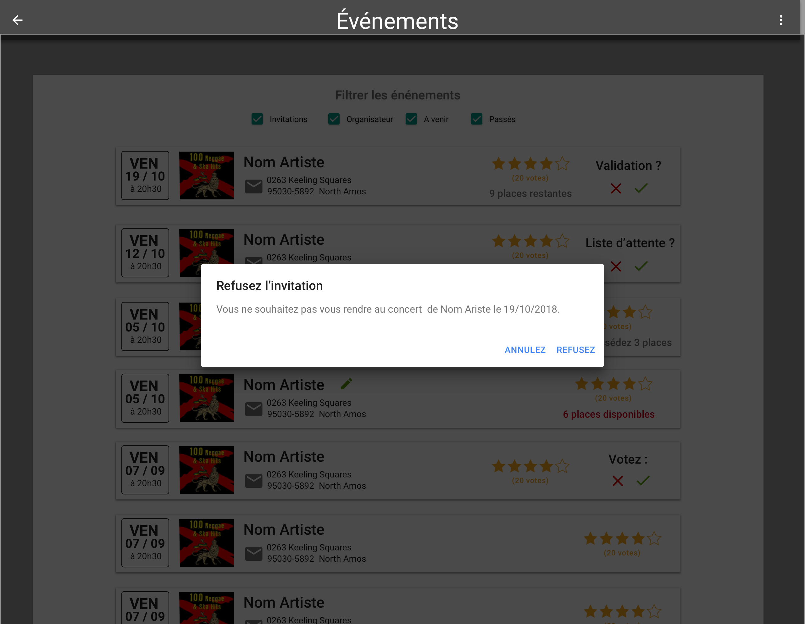
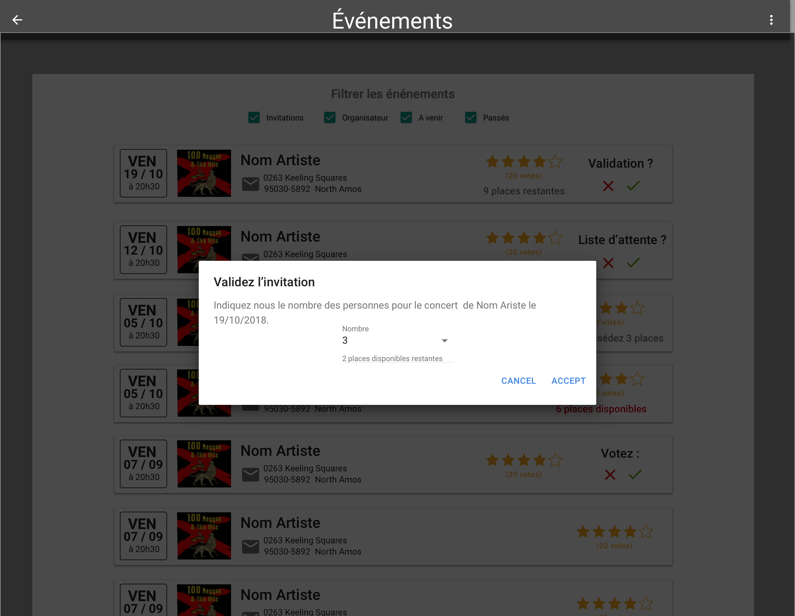
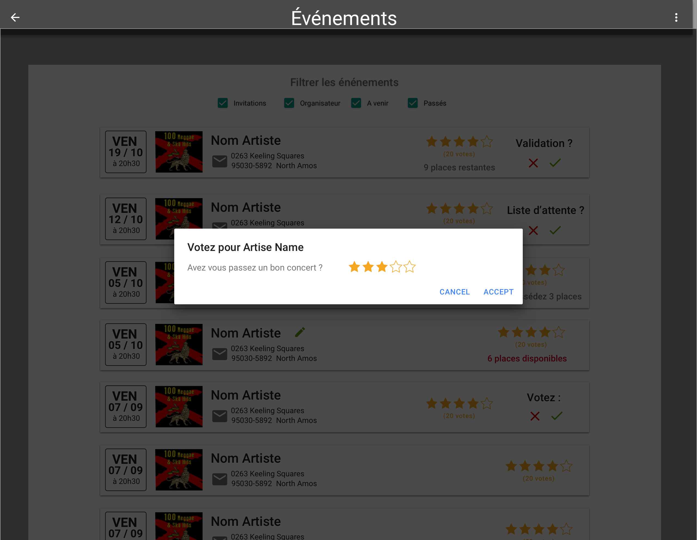

# Page Events

## Description

En tant qu'utilisateur (user et artiste), je souhaite visualiser la liste d'événements auxquels mon
compte est rattaché.

## Critères d'acceptance

- un filtre sera mis en place pour filtrer les événements
    - Invitation : Events où l'utilisateur est invité
    - Organisateur : Events que l'utilisateur organisent
    - A venir : Events dont la date est supérieure à la date courante
    - Passés : Events dont la date est inférieure à la date courante

- Les events où je suis invité posséderont des boutons pour valider ou non mon invitation
- Les events ou je suis organisateur Afficheront le nombre de place encore disponibles
- Les events passés ou je ne suis rendu, me permettront de noter la prestation de l'artiste

